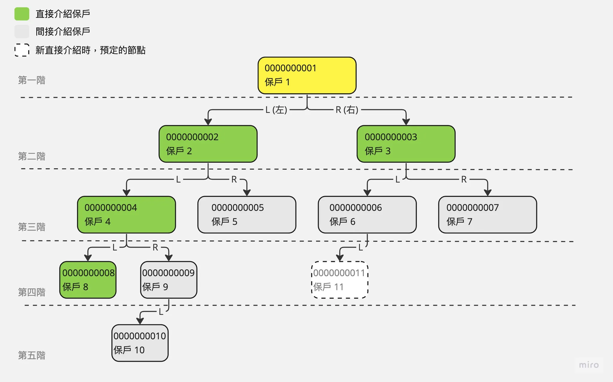

# 組織圖 (前端)

## 情境

---

目前您任職於一間軟體公司，有間保險業的客戶委託了一個「保戶介紹關係系統」。

## 規則說明

---

介紹關係的規則如下，

1. 保戶的介紹關係是以二元樹的組織方式呈現
2. 每個保戶可介紹的人數不限
3. 由保戶直接介紹的新保戶稱為「直接介紹保戶」
4. 由保戶直接介紹的新保戶再介紹的新保戶稱為「間接介紹保戶」
5. 每次產生介紹新保戶時，會產生在人數最少的節點下，當左右 2 邊人數相同時，會以左邊為優先
6. 每個保戶的基本資訊為「保戶編號」、「保戶姓名」、「加入(介紹)日期」、「介紹人保戶編號」

## 系統需求

---

### 客戶的需求

1. 以 Web 的方式呈現
2. 可以使用「保戶編號」搜尋保戶
3. 搜尋後以該保戶為「主節點」並呈現該保戶 4 階的介紹關係
4. 原搜尋的保戶「主節點」以不同顏色區別
5. 每個子節點以不同顏色區別「直接介紹」& 「間接介紹」客戶
6. 每個子節點點擊後，會以該結點為「主節點」再呈現 4 階的介紹關係

### 畫面草稿圖

## API 規格

---

### 保戶查詢

Endpoint： `/api/policyholders`

Method：GET

Query Parameters：

| 名稱 | 必填 | 資料類型 | 說明 | 範例 |
| --- | --- | --- | --- | --- |
| code | Y | string | 保戶編號 |  |

Response type：`application/json`
Response body：

| 名稱 | 資料類型 | 說明 | 範例 |
| --- | --- | --- | --- |
| code | String | 保戶編號 |  |
| name | String | 保戶姓名 |  |
| registration_date | DateTime | 加入日 |  |
| introducer_code | String | 介紹人保戶編號 |  |
| l | List<Object> | 左樹 | `{ 
    code: string,
    name: string,
    registration_date: date,
    introducer_code: string 
}[]` |
| r | List<Object> | 右樹 | `{ 
    code: string,
    name: string,
    registration_date: date,
    introducer_code: string 
}[]` |

### 保戶上層查詢

Endpoint： `/api/policyholders/{code}/top`

Method：GET

Path Parameters：

| 名稱 | 必填 | 資料類型 | 說明 | 範例 |
| --- | --- | --- | --- | --- |
| code | Y | string | 保戶編號 |  |

Response type：`application/json`
Response body：

| 名稱 | 資料類型 | 說明 | 範例 |
| --- | --- | --- | --- |
| code | String | 保戶編號 |  |
| name | String | 保戶姓名 |  |
| registration_date | DateTime | 加入日 |  |
| introducer_code | String | 介紹人保戶編號 |  |
| l | List<Object> | 左樹 | `{ 
    code: string,
    name: string,
    registration_date: date,
    introducer_code: string 
}[]` |
| r | List<Object> | 右樹 | `{ 
    code: string,
    name: string,
    registration_date: date,
    introducer_code: string 
}[]` |

## 任務

---

1. 模擬上述 API 規格 (使用 Mock API 相關工具實作)。
2. 實作上述草稿圖的頁面功能。
3. 請注重在程式功能上，畫面的美化不在此測試的範圍內。